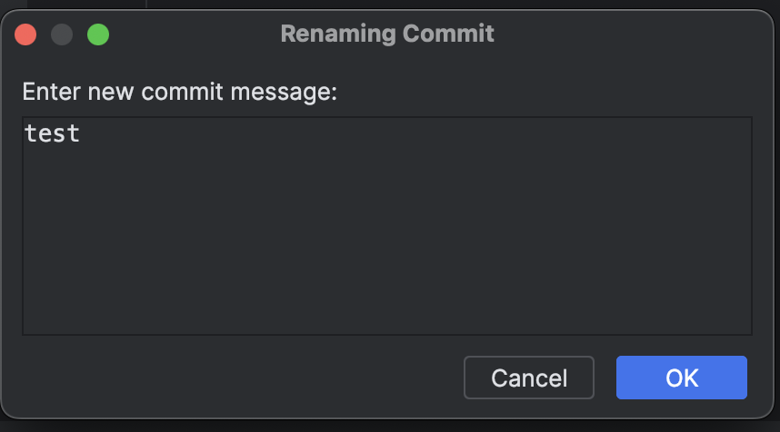

# Rename Current Commit Plugin

<!-- Plugin description -->
This plugin allows you to rename the last Git commit with a new message. It adds this action to the Git section in the main toolbar.
<!-- Plugin description end -->

## Implementation

Action is added to Git main menu and toolbar both in new and classic UI.

Before allowing the commit message to be changed, the plugin checks:

- Whether there are staged changes, warning the user that they will be included in the amended commit.
- Whether the commit has already been pushed, warning the user that amending it will create a new commit diverging from the remote branch.

Git commands are executed using GitLineHandler, interacting directly with Git rather than relying on IntelliJ’s higher-level Git API.

Git command results are checked for errors before further execution. Errors are displayed using Messages.showErrorDialog()

All Git operations are executed in a background coroutine scope using IO Dispatcher. UI-related actions, such as displaying dialogs, are explicitly switched to the EDT.

---
Plugin based on the [IntelliJ Platform Plugin Template][template].

[template]: https://github.com/JetBrains/intellij-platform-plugin-template
[docs:plugin-description]: https://plugins.jetbrains.com/docs/intellij/plugin-user-experience.html#plugin-description-and-presentation
